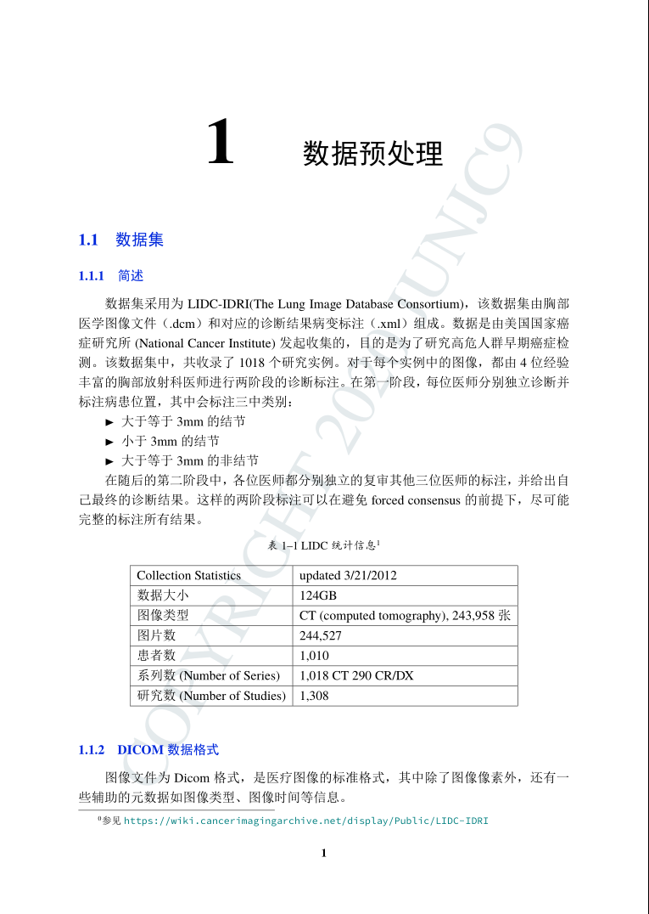
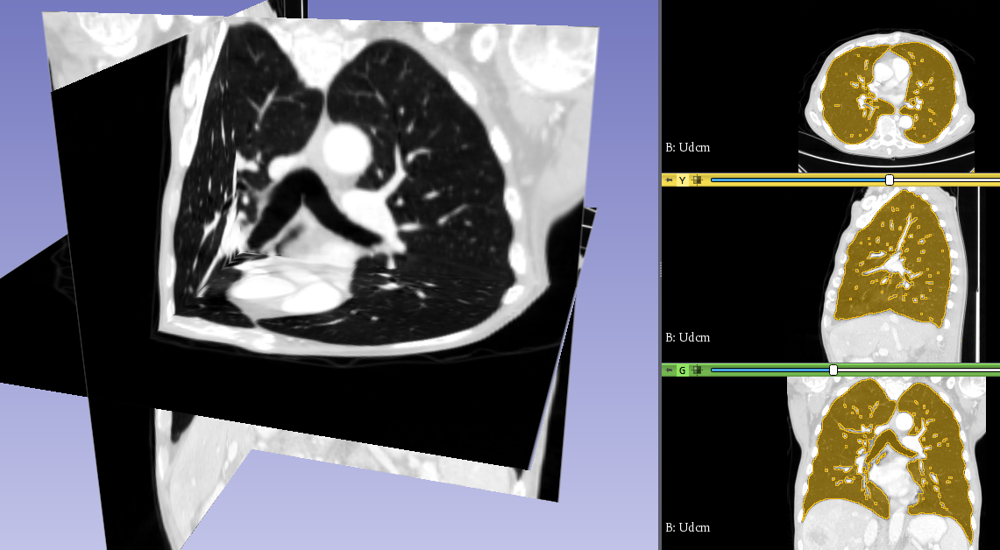
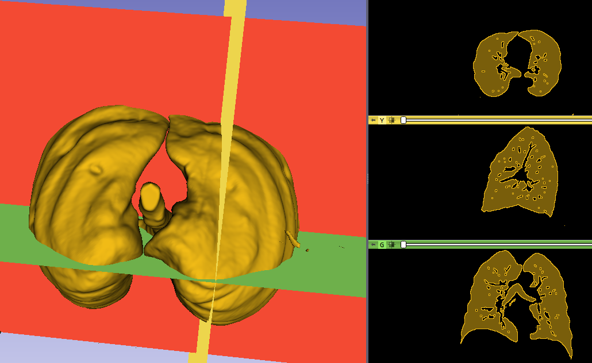
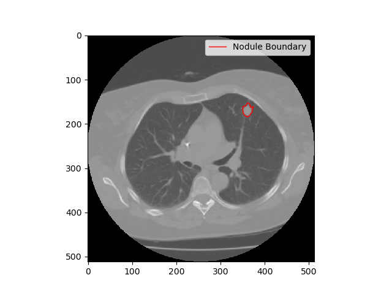
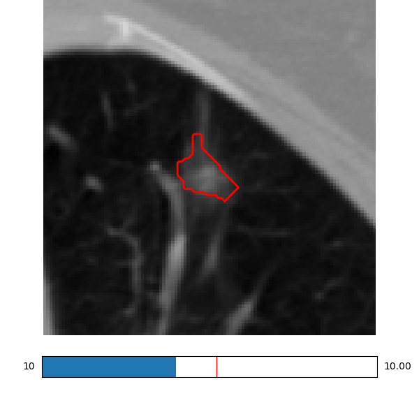
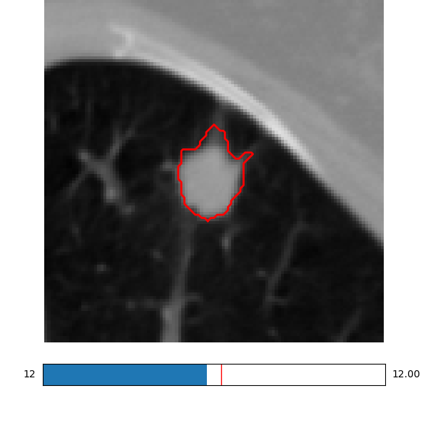
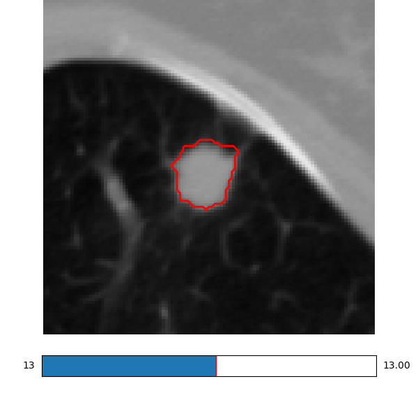
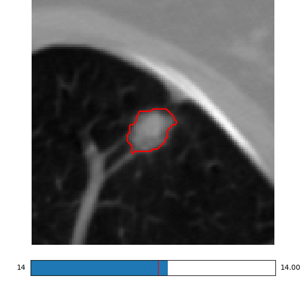
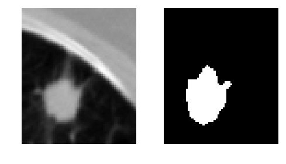

</img>


<h1 align="center">CT影像中的<strong>肺结节</strong>病灶筛查</h1>


</br>

## Introduction



## online docs




>     肺结节（pulmonary nodule）的医学定义：边界清楚的、影像学不透明的、直径≤3cm、周围完全被含气肺组织包绕的单发或多发的肺部结节，不伴有肺不张、肺门肿大和胸腔积液。（当直径>3cm，就称为“肿块”了~，一般都是恶性的）



<table>
  <tr>
    <td vlign="center">
        
    </td>
    <td vlign="center">
        
    </td>
    <td vlign="center">
        
    </td>
    <td vlign="center">
        
    </td>
  </tr>
</table>



[Udcm](https://dev.junjc9.com/udcm)

## License 许可

```sh
Copyright 2019 junjc9

Licensed under the Apache License, Version 2.0 (the "License");
you may not use this file except in compliance with the License.
You may obtain a copy of the License at

    http://www.apache.org/licenses/LICENSE-2.0

Unless required by applicable law or agreed to in writing, software
distributed under the License is distributed on an "AS IS" BASIS,
WITHOUT WARRANTIES OR CONDITIONS OF ANY KIND, either express or implied.
See the License for the specific language governing permissions and
limitations under the License.
```